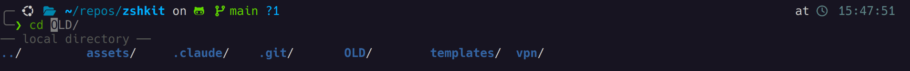
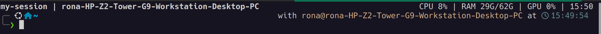

# zshkit

[Setup details](SETUP_DETAILS.md) · [Usage guide](USAGE_GUIDE.md)

zshkit is my personal terminal setup bundled into a single install script. It compiles my favorite community tools (like Zellij, fzf, zoxide, and Powerlevel10k) with some custom helpers so I don't have to manually configure my environment on every new machine. Feel free to use it or borrow from it.

| To do this... | Run this | Powered by |
| :--- | :--- | :--- |
| Keep a remote session alive across disconnects | `zj` | [Zellij](https://zellij.dev/) |
| Jump instantly to a frequent directory | `z <name>` | [zoxide](https://github.com/ajeetdsouza/zoxide) |
| Fuzzy-search history or insert a file path | `Ctrl+R` / `Ctrl+T` | [fzf](https://github.com/junegunn/fzf) |
| Interactively browse disk usage | `ncdu` | [ncdu](https://dev.yorhel.nl/ncdu) |
| Syntax-highlighted prompt with git status | _(always on)_ | [Powerlevel10k](https://github.com/romkatv/powerlevel10k) |
| History suggestions as you type | _(always on)_ | [zsh-autosuggestions](https://github.com/zsh-users/zsh-autosuggestions) |

## Quick Start

1. Clone this repo and `cd` into it.
2. Run the installer:

```bash
bash setup_zsh.sh
```

**Requirements:** Linux (Ubuntu/Debian) or macOS with [Homebrew](https://brew.sh).

After it finishes:

1. Set your terminal font to [MesloLGS NF](https://github.com/romkatv/powerlevel10k/tree/master?tab=readme-ov-file#fonts) (recommended by Powerlevel10k) so prompt icons render correctly. _(Not sure how to change your terminal's font? [See the per-terminal instructions here](https://github.com/romkatv/powerlevel10k#terminal-emulator-font-configuration).)_
2. Open a new terminal.
3. Run `p10k configure` to pick your prompt style.

The installer backs up your existing config before making any changes. To roll back:

```bash
bash rollback.sh
```

For full install details, what gets backed up, customization, and troubleshooting see [SETUP_DETAILS.md](SETUP_DETAILS.md).

## What you get

- **SSH helper** — `sshv` adds a connection timeout, resets terminal state, and hints to run `vpn-connect` if the connection fails
- **Persistent remote sessions** — `zj <name>` starts or reconnects to a terminal session that survives disconnects; start a long run, close your laptop, reconnect later
- **Prompt** — [git status](https://github.com/romkatv/powerlevel10k/tree/master?tab=readme-ov-file#what-do-different-symbols-in-git-status-mean), current directory, and whether the last command succeeded
- **Suggestions** — completions from history as you type; `Tab` to browse options
- **History search** — `Ctrl+R` fuzzy search; `Ctrl+T` insert file path; `Alt+C` cd
- **Navigation** — `z` to jump to recent directories, clearer file listings
- **Disk usage** — `ducks` for a quick summary, `ncdu` to drill down
- **Optional** — VPN helpers, EC2 instance manager

## Prompt

[Git status](https://github.com/romkatv/powerlevel10k/tree/master?tab=readme-ov-file#what-do-different-symbols-in-git-status-mean), current directory, and command duration at a glance.
Powered by [Powerlevel10k](https://github.com/romkatv/powerlevel10k/tree/master).


Style is configurable via `p10k configure`:


## Suggestions and completion

Gray tail appears as you type. `Tab` opens a menu to browse options.



## History search and file picking

`Ctrl+R` opens a fuzzy search over your full shell history.

| Key | Action |
|-----|--------|
| `Ctrl+R` | Fuzzy search history |
| `Ctrl+T` | Fuzzy insert a file path at the cursor |
| `Alt+C` | Fuzzy `cd` into a directory |

## Directory jumping

`z` jumps to a frequently visited directory by fuzzy-matching against your
history — no need to type the full path.

```bash
z proj      # jump to the most frequent directory matching "proj"
z ml exp    # narrow by multiple terms
zi          # interactive picker with fzf
```

Uses [zoxide](https://github.com/ajeetdsouza/zoxide) when installed, otherwise
falls back to the [z plugin](https://github.com/agkozak/zsh-z).

## Disk usage

```bash
ducks        # top-level sizes in the current directory
ncdu         # interactive drill-down browser
ncdu /       # drill down from root to find what's using space
```

## SSH helpers

`sshv` wraps `ssh` with a 10-second connection timeout, terminal mouse reset, and a hint to run `vpn-connect` if the connection fails.

```bash
sshv user@host
```

VPN helpers (optional, requires OpenVPN config):

```bash
vpn-connect     # connect in a detached background session
vpn-disconnect  # disconnect
vpn-status      # show current status
```

## Zellij — sessions that survive disconnects



Start or reconnect to a named workspace — useful for keeping remote SSH work
alive across disconnects:

```bash
zj          # pick from active sessions (or start "main" if none)
zj my-session     # attach to or create a session named "my-session"
```

Start a training run over SSH, close your laptop, reconnect later — the
session is still there. See [USAGE_GUIDE.md](USAGE_GUIDE.md) for keybindings,
floating panes, scrollback search, and more.

> **Tip:** For this to work, run `bash setup_zsh.sh` on the **remote machine** too — Zellij needs to be installed there for the session to live on the remote side. Your local install gives you the shell setup; the remote install is what keeps your sessions alive across disconnects.

## Docs

- [SETUP_DETAILS.md](SETUP_DETAILS.md) — install details, customization,
  troubleshooting, rollback
- [USAGE_GUIDE.md](USAGE_GUIDE.md) — aliases, keybindings, Zellij, fzf, VPN, EC2
- [AGENTS.md](AGENTS.md) — notes for AI coding agents

## Updating

```bash
git pull
bash setup_zsh.sh
```
