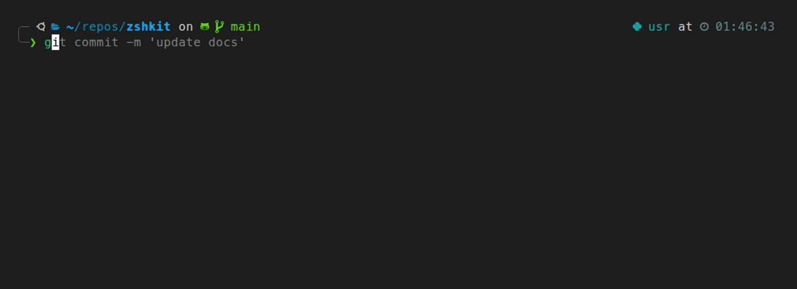
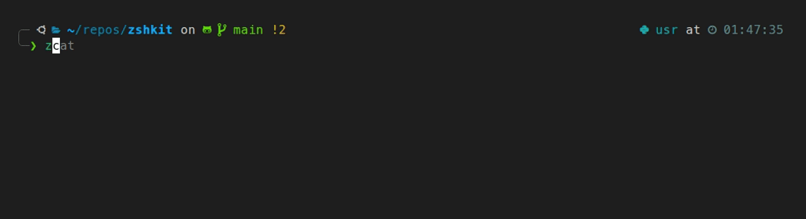

# zshkit

[Setup details](SETUP_DETAILS.md) · [Usage guide](USAGE_GUIDE.md) · [Ghostty](GHOSTTY.md)

A single install script that sets up a fast, opinionated shell environment on any Linux or macOS machine. Bundles Zellij, fzf, zoxide, Powerlevel10k, and custom helpers so you're productive immediately.

| To do this... | Run this | Powered by |
| :--- | :--- | :--- |
| Keep a remote session alive across disconnects | `zj` | [Zellij](https://zellij.dev/) |
| SSH into a remote host and attach to a Zellij session | `zjs host [session]` | [Zellij](https://zellij.dev/) |
| Jump instantly to a frequent directory | `z <name>` | [zoxide](https://github.com/ajeetdsouza/zoxide) |
| Fuzzy-search history or insert a file path | `Ctrl+R` / `Ctrl+T` | [fzf](https://github.com/junegunn/fzf) |
| Mount remote files locally | `rmount host [path]` | [sshfs](https://github.com/libfuse/sshfs) |
| Interactively browse disk usage | `ncdu` | [ncdu](https://dev.yorhel.nl/ncdu) |
| Syntax-highlighted prompt with git status | _(always on)_ | [Powerlevel10k](https://github.com/romkatv/powerlevel10k) |
| History suggestions as you type | _(always on)_ | [zsh-autosuggestions](https://github.com/zsh-users/zsh-autosuggestions) |

## Quick Start

```bash
git clone https://github.com/ronamit/zshkit && cd zshkit
bash setup_zsh.sh        # interactive — prompts before each install
bash setup_zsh.sh --yes  # non-interactive — auto-confirms all prompts
```

The script resolves the latest versions of Zellij, carapace-bin, and zellij-attention from GitHub at runtime. Pin any of them with env vars if needed: `ZELLIJ_VERSION=v0.44.0 bash setup_zsh.sh`.

On Linux, `--yes` still requires non-interactive `sudo` for package installs and terminfo setup. Prefer interactive runs (enter your password when prompted) over blanket passwordless `sudo` for your user; use a narrow provisioning exception only if you truly need unattended installs.

**Requirements:** Linux (Ubuntu/Debian) or macOS with [Homebrew](https://brew.sh).

After it finishes:

1. Set your terminal font to [MesloLGS NF](https://github.com/romkatv/powerlevel10k/tree/master?tab=readme-ov-file#fonts) so prompt icons render correctly.
2. Open a new terminal and run `p10k configure` to pick your prompt style.
3. The setup installs [Ghostty](https://ghostty.org) as the default terminal with a starter config. Edit `~/.config/ghostty/config` and reload with `Ctrl+Shift+,`.

The installer backs up your existing config. To roll back: `bash rollback.sh`

**Personal settings go in `~/.zshrc.local`** — the installer creates this file with a commented template. It is sourced at shell startup and never overwritten by updates. Do not edit `~/.zshrc` directly; it is managed and will be overwritten on the next `setup_zsh.sh` run.

See [SETUP_DETAILS.md](SETUP_DETAILS.md) for full install details and customization.



## Autocomplete and suggestions

Gray suggestion appears as you type. `Tab` accepts the full ghost text instantly, or opens the completion grid if none is showing. Options appear automatically below the prompt as you type — press `↓` to enter the grid.

| Key | Action |
|-----|--------|
| `Tab` | Accept full ghost text (if showing), otherwise enter completion grid |
| `↓` | Enter completion grid (if auto-list showing), or newer history match |
| `→` | Accept one character of the suggestion |
| `Ctrl+→` / `Alt+F` | Accept one word of the suggestion |
| `↑` | Prefix history search — older match |
| `Ctrl+R` | Fuzzy search full history |
| `Ctrl+T` | Insert a file path at the cursor |
| `Alt+C` | Fuzzy change directory |

## Navigation

**Completion grid:** options with descriptions appear below the prompt as you type; `↓` enters the grid for any command, not just `cd`.
**History search:** `↑` searches older commands matching what you've typed so far; `↓` then moves forward through matches.
`..` goes up a directory. `z` jumps anywhere by keyword.

```bash
cd ~/.config/  # then press ↓ — opens directory menu, arrow keys to select
cd ~/.c        # then press ↑ — history search for older matches; ↓ for newer
..             # go up one directory
z zsh          # jump to ~/repos/zshkit by keyword
z ghostty      # jump to ~/.config/ghostty
```



## VPN

Credentials are stored once in a file — connecting only asks for your 2FA authenticator code (or nothing if your VPN doesn't require it). The session runs detached in the background; you can close the terminal and the VPN keeps running.

```bash
vpn-connect      # prompt for 2FA code, then connect in a background session
vpn-disconnect   # disconnect
vpn-status       # show current status
```

Optional — requires an OpenVPN `.ovpn` config file and your credentials. The installer sets up the helper scripts; you fill in the credentials file it creates. See [SETUP_DETAILS.md](SETUP_DETAILS.md) for the exact paths and steps.

## EC2 VM (AWS)

`vm` connects to a remote machine. Set `EC2_SSH_HOST` in `~/.zshrc.local` to SSH directly with no AWS involved. Add `EC2_INSTANCE_ID` too for full AWS integration (auto-start, stop, status).

```bash
vm              # SSH in (direct if EC2_SSH_HOST set; via AWS otherwise)
vm status       # show instance state and IP  (AWS)
vm start        # start the instance          (AWS)
vm stop         # stop the instance           (AWS)
sso             # refresh AWS SSO session
```

Optional — see [SETUP_DETAILS.md](SETUP_DETAILS.md) for configuration.

## Remote File Browsing (SSHFS)

`rmount` mounts a remote directory over SSH so you can browse, open, and drag-and-drop files as if they were local. Mount points mirror the remote path under `~/mnt/<host>/`.

```bash
rmount myserver              # mount home dir → ~/mnt/myserver
rmount myserver /data/proj   # mount specific path → ~/mnt/myserver/data/proj
rmount open myserver         # mount + open in file manager
rmount ls                    # list active mounts
rmount umount myserver       # unmount
```

Hosts in `~/.ssh/config` are tab-completed. Requires `sshfs` (installed by `setup_zsh.sh`; macOS also needs the `macfuse` cask — see [SETUP_DETAILS.md](SETUP_DETAILS.md)).

## SSH

`sshv` wraps `ssh` with sensible defaults for flaky networks: a 15-second connect timeout, client keepalives (`ServerAliveInterval=10`, `ServerAliveCountMax=2`) unless you set your own `ServerAliveInterval`, and a reset of local terminal input modes so mouse/keyboard modes from remote tmux/Zellij/vim do not leak into the shell after disconnect.

In interactive terminals, if the session exits with code `255` and the session ran longer than `ConnectTimeout` (meaning the connection was actually established before dropping), `sshv` retries the same command once. Failures where the host was never reached — timeout, wrong hostname, VPN down — are not retried; you get a short hint about VPN/reconnect instead. Pass `-o ServerAliveInterval=…` (or any arg containing that text) to skip injecting keepalives. Normal `ssh` is unchanged.

```bash
sshv user@host
```

## Persistent sessions with Zellij

Sessions survive disconnects — close your laptop mid-run and reconnect later.

```bash
zj                  # pick from active sessions (or start one named after current dir)
zj my-session       # attach to or create a named session
zjs myserver        # SSH into a host and attach to a Zellij session in one step
zjs myserver work   # specify the session name
```

> **Remote sessions:** run `bash setup_zsh.sh` on the remote machine too — Zellij needs to be installed there for sessions to live on the remote side.
> **Text selection:** Zellij captures mouse events for scroll and pane focus. To select text with the mouse, hold **`Shift`** while dragging, then press `Enter` or `y` to copy.
> **Scrollback in editor:** `Ctrl+s` → `e` opens the full pane scrollback in micro — use `Ctrl+A` to select all, `Ctrl+C` to copy, `Ctrl+Q` to quit.

## Disk usage

```bash
ducks        # quick summary of current directory
ncdu         # interactive drill-down
```

## Docs

- [SETUP_DETAILS.md](SETUP_DETAILS.md) — install details, customization, rollback
- [USAGE_GUIDE.md](USAGE_GUIDE.md) — all aliases, keybindings, Zellij, fzf, VPN, EC2
- [GHOSTTY.md](GHOSTTY.md) — Ghostty keybindings, tabs, splits, search, and config reference
- [AGENTS.md](AGENTS.md) — notes for AI coding agents

## Updating

```bash
git pull && bash setup_zsh.sh
```

Re-running `setup_zsh.sh` is safe — it skips already-installed components and re-resolves the latest versions of directly-downloaded tools.
