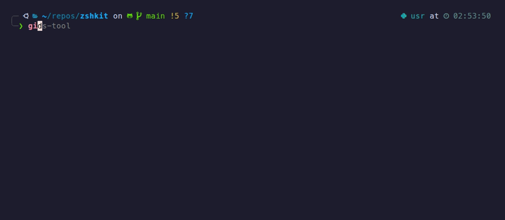
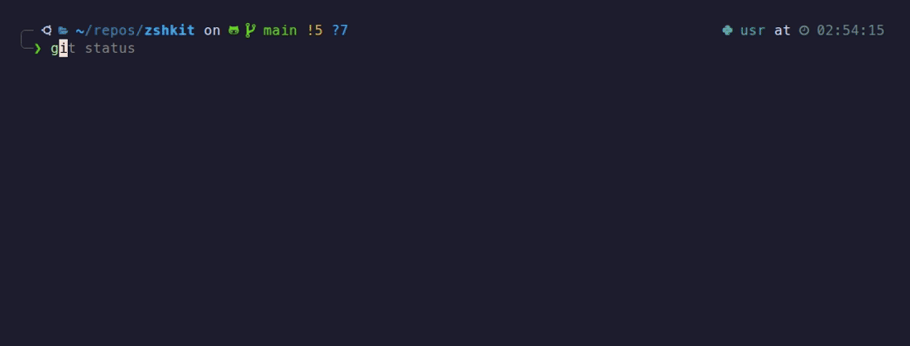
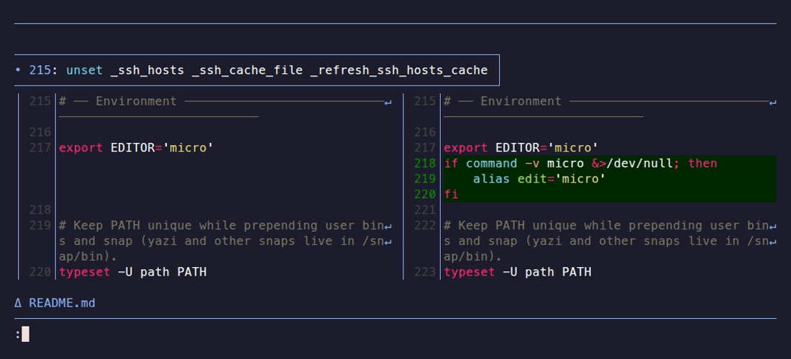
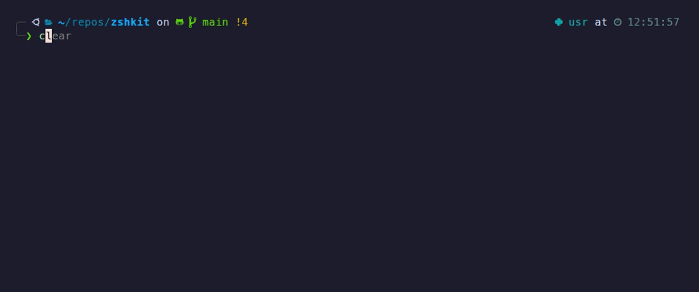
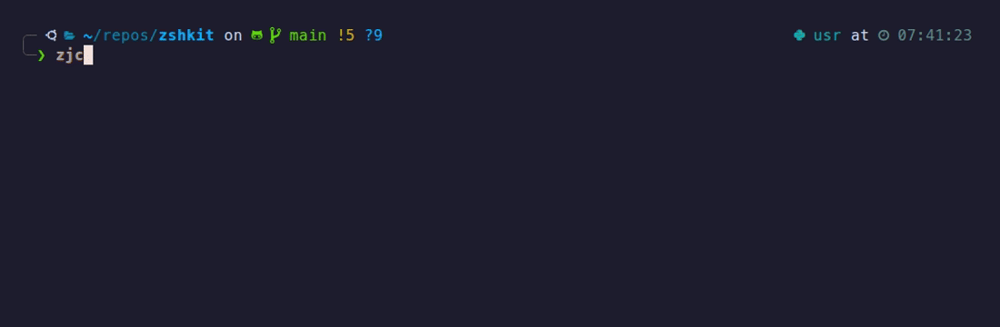
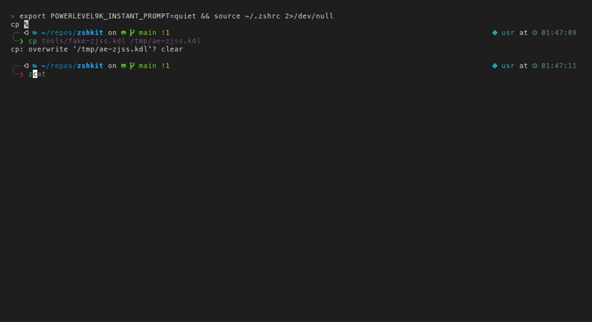
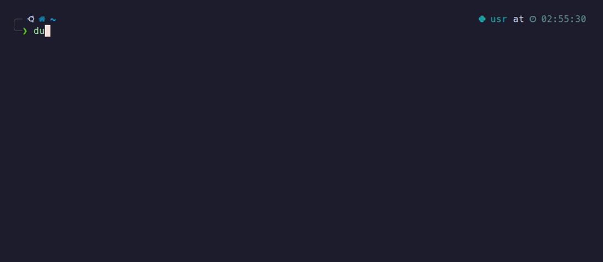

# zshkit

[Setup details](SETUP_DETAILS.md) · [Usage guide](USAGE_GUIDE.md)

A single install script that sets up a fast, opinionated shell environment on any Linux or macOS machine. Bundles Zellij, fzf, zoxide, Powerlevel10k, and custom helpers so you're productive immediately.

| To do this... | Run this | Powered by |
| :--- | :--- | :--- |
| Keep a remote session alive across disconnects | `zj` | [Zellij](https://zellij.dev/) |
| SSH into a remote host and attach to a Zellij session | `zjs host [session]` | [Zellij](https://zellij.dev/) |
| Jump instantly to a frequent directory | `z <name>` | [zoxide](https://github.com/ajeetdsouza/zoxide) |
| Fuzzy-search history or insert a file path | `Ctrl+R` / `Ctrl+T` | [fzf](https://github.com/junegunn/fzf) |
| Interactively browse disk usage | `ncdu` | [ncdu](https://dev.yorhel.nl/ncdu) |
| Syntax-highlighted prompt with git status | _(always on)_ | [Powerlevel10k](https://github.com/romkatv/powerlevel10k) |
| History suggestions as you type | _(always on)_ | [zsh-autosuggestions](https://github.com/zsh-users/zsh-autosuggestions) |

## Quick Start

```bash
git clone https://github.com/ronamit/zshkit && cd zshkit
bash setup_zsh.sh        # interactive
bash setup_zsh.sh --yes  # non-interactive
```

**Requirements:** Linux (Ubuntu/Debian) or macOS with [Homebrew](https://brew.sh).

After it finishes:

1. Set your terminal font to [MesloLGS NF](https://github.com/romkatv/powerlevel10k/tree/master?tab=readme-ov-file#fonts) so prompt icons render correctly.
2. Open a new terminal and run `p10k configure` to pick your prompt style.
3. The setup installs [Kitty](https://sw.kovidgoyal.net/kitty/) as the default terminal with a starter config. Press `Ctrl+Shift+F2` to edit it. Ghostty and iTerm2 are good alternatives.

The installer backs up your existing config. To roll back: `bash rollback.sh`

**Personal settings go in `~/.zshrc.local`** — the installer creates this file with a commented template. It is sourced at shell startup and never overwritten by updates. Do not edit `~/.zshrc` directly; it is managed and will be overwritten on the next `setup_zsh.sh` run.

See [SETUP_DETAILS.md](SETUP_DETAILS.md) for full install details and customization.

## Prompt

Git-aware prompt: branch, dirty status, and command duration at a glance.



## Autocomplete and suggestions

Gray suggestion appears as you type — `→` to accept, `↓` to cycle through older matches. `Ctrl+R` for fuzzy history search.





| Key | Action |
|-----|--------|
| `→` | Accept suggestion |
| `↓` | Cycle to older history match |
| `Ctrl+R` | Fuzzy search full history |
| `Ctrl+T` | Insert a file path at the cursor |
| `Alt+C` | Fuzzy change directory |

## Navigation

`Tab` completes paths. `z` jumps to recently visited directories by keyword. `cd -` goes back.



```bash
cd ~/.con<Tab>   # complete to ~/.config/
z zsh            # jump to ~/repos/zshkit (or wherever you use it most)
z kitty          # jump to ~/.config/kitty
cd -             # go back to previous directory
```

## VPN

```bash
vpn-connect      # connect in a detached background session
vpn-disconnect   # disconnect
vpn-status       # show current status
```

Optional — requires an OpenVPN `.ovpn` config file and your credentials. The installer sets up the helper scripts; you fill in the credentials file it creates. See [SETUP_DETAILS.md](SETUP_DETAILS.md) for the exact paths and steps.

## EC2 VM (AWS)

`vm` connects to a dev VM. Set `EC2_SSH_HOST` in `~/.zshrc.local` to SSH directly with no AWS involved. Add `EC2_INSTANCE_ID` too for full AWS integration (auto-start, stop, status).

```bash
vm              # SSH in (direct if EC2_SSH_HOST set; via AWS otherwise)
vm status       # show instance state and IP  (AWS)
vm start        # start the instance          (AWS)
vm stop         # stop the instance           (AWS)
```

Optional — see [SETUP_DETAILS.md](SETUP_DETAILS.md) for configuration.

## SSH

`sshv` wraps `ssh` with a 10-second connection timeout and terminal mode reset.

```bash
sshv user@host
```

## Persistent sessions with Zellij

Sessions survive disconnects — close your laptop mid-run and reconnect later.



```bash
zj                  # pick from active sessions (or start one named after current dir)
zj my-session       # attach to or create a named session
zjs myserver        # SSH into a host and attach to a Zellij session in one step
zjs myserver work   # specify the session name
```

> **Remote sessions:** run `bash setup_zsh.sh` on the remote machine too — Zellij needs to be installed there for sessions to live on the remote side.

`zjss` opens a split Zellij layout with each pane SSH-ed into the same host under its own session — useful for monitoring a GPU training run from multiple angles at once.



```bash
zjss myserver               # 2x2 split, sessions 0 1 2 3
zjss myserver train eval    # side-by-side, 2 sessions
zjss myserver a b c d       # 2x2, custom session names
```

## Disk usage

`ducks` shows top-level sizes sorted by largest first.



```bash
ducks        # quick summary of current directory
ncdu         # interactive drill-down
```

## Docs

- [SETUP_DETAILS.md](SETUP_DETAILS.md) — install details, customization, rollback
- [USAGE_GUIDE.md](USAGE_GUIDE.md) — all aliases, keybindings, Zellij, fzf, VPN, EC2
- [AGENTS.md](AGENTS.md) — notes for AI coding agents

## Updating

```bash
git pull && bash setup_zsh.sh
```

Re-running `setup_zsh.sh` also updates Kitty to the latest upstream release.
